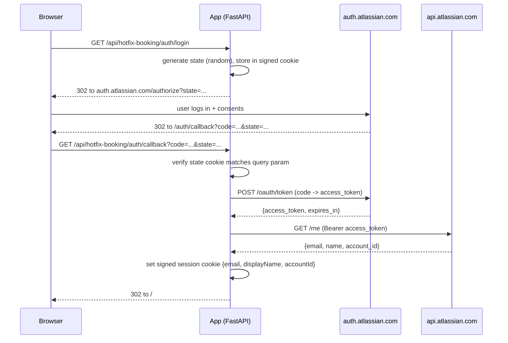

# Plan: Real Jira login via Atlassian OAuth 2.0 (3LO)

> **Status: APPROVED** — decisions locked in below. Ready to start Phase 1 once the OAuth app is registered.

## Decisions (locked in)

- **Gate everything.** All `/api/hotfix-booking/*` endpoints require a session — reads and writes. Logged-out visitors see only the login screen.
- **No feature flag / no `AUTH_MODE`.** App is not deployed yet and Antonios is the only user. Straight cutover in dev. Simpler code, fewer conditionals to delete later.
- **`itsdangerous` gets added to `pyproject.toml`.** Already installed transitively via Starlette; making it explicit prevents future dep-cleanup accidents.
- **Antonios registers the OAuth app** himself in the Atlassian Developer Console.
- **Callback URL (dev only for now):** `http://localhost:3001/api/hotfix-booking/auth/callback`. Prod URL added later when the app is deployed — 30-second dev-console change, no code touch.
- **Session lifetime: 365 days.** Internal tool, low risk. Note: rotating `SESSION_SECRET_KEY` logs everyone out — that's the recovery lever if a cookie leaks.

## TL;DR

Replace the self-declared-email modal with a "Log in with Atlassian" button. User clicks it → Atlassian consent screen → redirected back → we exchange the auth code for an access token → call `https://api.atlassian.com/me` to get their canonical email + display name → drop the token, set a signed session cookie valid for 30 days → done. Every subsequent request to `/api/hotfix-booking/*` reads the session cookie server-side. `/book` and `/cancel` no longer accept `bookedByEmail` from the client — the server takes it from the session. No new runtime dependencies (uses Starlette's built-in `SessionMiddleware`, which brings `itsdangerous` transitively; adding it explicitly to `pyproject.toml` is the only dep change).

## What this fixes

- **Spoofing.** Today, anyone can type `someoneelse@neovest.com` and book / cancel as them. After: your session cookie is signed with a server-side secret you don't have, and it's tied to your Atlassian login. Not spoofable without stealing the cookie.
- **Audit clarity.** `bookedBy` becomes provably who was logged in, not who they claimed to be.
- **Admin path.** `ADMIN_EMAILS` still works, but the admin's identity is now verified — no more "type any admin's email to override".

## What this does NOT change

- Server still calls Jira with the shared `JIRA_API_TOKEN` (owned by the `JIRA_EMAIL` service-ish account). We are **not** switching to per-user Jira tokens. OAuth is for **identity only** — proving who's using the app, not talking to Jira as them.
- Booking data model, DAG math, Teams notifications, cleanup — all untouched.
- Front-end structure — same SPA, same views. Only the identity widget and the first-visit modal change.

## Design

### The OAuth flow (what the user sees)

1. First visit, or session expired → the app shows a single **"Log in with Atlassian"** button. Nothing else works until they click it.
2. Click → browser navigates to `https://auth.atlassian.com/authorize?...` with our `client_id`, `scope=read:me offline_access`, `redirect_uri=<APP_BASE_URL>/api/hotfix-booking/auth/callback`, a random `state`, `response_type=code`, `prompt=consent`.
3. Atlassian asks the user to log in (if they aren't already) and shows a consent screen: *"Hotfix Booking wants to view your Atlassian profile"*. First time only — subsequent logins skip consent.
4. Atlassian redirects back to our callback with `?code=...&state=...`.
5. Our callback verifies the `state`, POSTs the code to `https://auth.atlassian.com/oauth/token`, gets an `access_token`, calls `GET https://api.atlassian.com/me` with that token, receives `{email, name, account_id}`, drops the token, sets a signed session cookie, and 302s to `/`.
6. From now on, every `/api/hotfix-booking/*` call sees `request.session["user"] = {email, displayName, accountId}`.

### The OAuth flow (what happens server-side)



### Why `read:me` + `offline_access` only

We only need to know **who the user is**. We don't need to read Jira issues as them — the server keeps doing that with `JIRA_API_TOKEN`. So one scope: `read:me`. Adding `offline_access` gives us a refresh token, but honestly **we don't need it either** because after the initial login we only care about the identity, not making further Atlassian API calls. I've included it in the scope list purely because it makes the consent screen say "keep me logged in" instead of "log in every hour", but we don't have to store the refresh token — we drop it after `/me` returns. Recommend: **request `read:me` only, no `offline_access`**. Simpler consent, no token storage burden. Our session cookie handles "stay logged in for 30 days" independently of Atlassian's token lifetimes.

### Session storage

- **Signed cookie**, not server-side sessions. Starlette's built-in `SessionMiddleware` uses `itsdangerous` to sign a JSON blob with a secret key. Tamper-proof, no database needed. Fits the app's zero-infrastructure ethos.
- Contents: `{"user": {"email": "...", "displayName": "...", "accountId": "..."}, "iat": <epoch>}`. Total ~200 bytes, well under the 4KB cookie limit.
- Lifetime: 365 days (`max_age=31_536_000`), `HttpOnly=True`, `SameSite=Lax`, `Secure=True` when `APP_BASE_URL` starts with `https://`.
- **Secret rotation** invalidates every session (everyone re-logs in). That's the recovery mechanism if the secret leaks.

### CSRF state parameter

- Generate 32 random bytes → hex → put in a **short-lived signed cookie** (`hb_oauth_state`, `max_age=600`, 10 min) AND pass as the `state` query param on the authorize URL.
- Callback compares the query `state` to the cookie; mismatch → 400. Cookie is deleted after use.
- The `state` cookie can also carry a `return_to` path so the user lands back where they were after logging in (nice-to-have, not phase-1).

### Auth on protected endpoints

Add a FastAPI dependency `require_user(request: Request) -> UserContext`:

```python
def require_user(request: Request) -> UserContext:
    user = request.session.get("user")
    if not user:
        raise HTTPException(status_code=401, detail="Not authenticated")
    return UserContext(**user)
```

Applied to **every** `/api/hotfix-booking/*` endpoint except the `/auth/*` group. Logged-out users get 401 on reads and writes alike. Front-end catches the 401 on the initial `/auth/me` call and shows the login screen.

### `/book` and `/cancel` changes

- `/book` request body loses `bookedBy` and `bookedByEmail`. Server pulls both from the session. `bookedBy` = session `displayName`, `bookedByEmail` = session `email`. **No more Jira user-search on POST.** Fewer failure modes, faster response.
- `/cancel` request body loses `cancelledByEmail`. Server pulls it from the session. Same authz logic (own booking / admin allow-list / matching Jira CM reporter) but keyed off the trusted session email.
- `GET /resolve-user` — **delete**. It's the modal's crutch and the modal is going away.

### New endpoints

| Method | Path | Purpose |
|---|---|---|
| GET  | `/auth/login`    | Redirects to Atlassian authorize URL. Optional `?return_to=/some/path`. |
| GET  | `/auth/callback` | Handles the OAuth callback, sets session cookie, 302 to `return_to` (or `/`). |
| POST | `/auth/logout`   | Clears session cookie, 204. |
| GET  | `/auth/me`       | Returns `{email, displayName, accountId}` or 401. Front-end calls this on load to decide whether to show the login screen. |

All under `/api/hotfix-booking/auth/`.

### Config additions

New env vars (add to `.env.example` and `config.Settings`):

```
# Atlassian OAuth 2.0 (3LO) — created in developer.atlassian.com
ATLASSIAN_CLIENT_ID=
ATLASSIAN_CLIENT_SECRET=
# 32+ random bytes hex-encoded; rotating this logs everyone out
SESSION_SECRET_KEY=
# Optional: session cookie lifetime in days (default 365)
SESSION_MAX_AGE_DAYS=365
# APP_BASE_URL already exists — must be set now (no longer optional).
# Used to build the redirect_uri and to decide Secure cookie flag.
APP_BASE_URL=http://localhost:3001
```

Redirect URI is always `<APP_BASE_URL>/api/hotfix-booking/auth/callback`. In dev this is `http://localhost:3001/...`; in prod, whatever the real hostname is. Atlassian requires an **exact** match, so both URLs must be registered in the Developer Console.

**`SESSION_SECRET_KEY`** — generate with `python -c "import secrets; print(secrets.token_hex(32))"`. Treat as a secret; do not commit; do not share across environments (dev / test / prod should each have their own so a leaked dev key can't forge prod sessions).

### Front-end changes (`static/`)

- Delete the first-visit modal (`#hbUserModal`) and its supporting JS (email lookup, localStorage plumbing).
- On page load, `fetch('/api/hotfix-booking/auth/me')`. If 401, replace the app body with a centered card: *"Hotfix Booking — Log in with Atlassian"* button linking to `/api/hotfix-booking/auth/login`. If 200, render the app as today.
- Header "Booking as: … [change]" widget becomes "Signed in as: **Alex K.** [sign out]". "Sign out" POSTs `/auth/logout` then reloads.
- Remove `bookedByEmail` from every `POST /book` and `POST /cancel` request body.
- Bump the `?v=N` cache-buster in `index.html`.

### Test plan

New tests (`tests/test_api_auth.py`):
- `test_login_redirects_to_atlassian_with_state_cookie`
- `test_callback_missing_state_returns_400`
- `test_callback_state_mismatch_returns_400`
- `test_callback_happy_path_sets_session_cookie_and_redirects` (respx mocks `auth.atlassian.com/oauth/token` and `api.atlassian.com/me`)
- `test_callback_token_exchange_failure_returns_502`
- `test_callback_me_call_failure_returns_502`
- `test_me_endpoint_returns_401_without_session`
- `test_me_endpoint_returns_user_with_session`
- `test_logout_clears_session_cookie`

Modify existing tests:
- `test_api_bookings.py`, `test_api_cancel.py` — every `POST /book` / `POST /cancel` test needs to set a session cookie first. Add a `logged_in_client` fixture in `conftest.py` that wraps `client` with a pre-signed session cookie for `test@neovest.com`.
- `test_api_users.py` (`GET /resolve-user`) — **delete** if we remove the endpoint. Keep `test_users.py` for the `resolve_jira_user` helper — the server still uses it internally for the CM-reporter admin path (`cancel` auth check c).
- `test_api_bookings.py::test_book_rejects_body_bookedByEmail_field` (new) — the body-shape change should be tested.
- Any test that manually constructs a booking with `bookedByEmail` in the body needs updating.

Fixtures:
- `tests/fixtures/atlassian/token_response.json` — sample `/oauth/token` response
- `tests/fixtures/atlassian/me_response.json` — sample `/me` response

### Migration / rollout

1. **Antonios registers the OAuth app** at https://developer.atlassian.com/console/myapps/ → Create → OAuth 2.0 integration. Add the "User identity API" permission → enable `read:me` scope. Add callback URL: `http://localhost:3001/api/hotfix-booking/auth/callback`. Copy the Client ID + Secret into `.env`. (Prod callback URL gets added later, when there's a prod URL.)
2. **Enable sharing** on the app (Distribution → toggle Sharing on) so teammates other than Antonios can log in when the app is eventually shared. Users will see a "not yet reviewed by Atlassian" warning on first consent — normal for internal integrations, dismissable.
3. **Cutover happens on the next `uvicorn` restart** after the code lands. Since Antonios is the only user today, this is a non-event: log in once, done.
4. **Data (`data/hotfix-bookings.json`) is unaffected.** `bookedBy` values already stored stay as-is.

### Phased implementation

**Phase 1 — Backend OAuth, no cutover** (~1 day)
- Register the OAuth app in Atlassian Developer Console
- Add `ATLASSIAN_CLIENT_ID`, `ATLASSIAN_CLIENT_SECRET`, `SESSION_SECRET_KEY` to config
- Add `itsdangerous` to `pyproject.toml` (needs approval — Golden Rule #3)
- Mount `SessionMiddleware` in `app.py`
- Implement `/auth/login`, `/auth/callback`, `/auth/logout`, `/auth/me` in a new `auth.py` module
- Write full test suite for the auth module (mocked Atlassian endpoints)
- **Do not touch `/book` or `/cancel` yet.** Ship it, verify login works end-to-end in dev.

**Phase 2 — Gate every endpoint** (~half day)
- Add `require_user` dependency, apply to every route in `routes.py` (not just writes)
- Drop `bookedByEmail` / `cancelledByEmail` from the request models
- Update existing tests to use the `logged_in_client` fixture

**Phase 3 — Front-end swap** (~half day)
- Replace modal with login card
- Wire header sign-in/sign-out
- Remove email fields from booking / cancel request payloads
- Bump `?v=` cache-buster
- Manual end-to-end smoke test

**Phase 4 — Delete `/resolve-user`** (~15 min)
- Only after Phase 3 has been live for a bit and nothing is calling it

### Security notes

- `state` cookie prevents login CSRF (the attack in Atlassian's docs). Mandatory, not optional.
- `HttpOnly` session cookie — JS can't read it, mitigating XSS session theft.
- `SameSite=Lax` — protects against cross-site POST but still allows top-level navigation from the Atlassian redirect back to our callback.
- `Secure` flag on in prod — auto-derived from `APP_BASE_URL.startswith("https://")`.
- Client secret is a **secret**. Same handling as `JIRA_API_TOKEN` and the Teams webhook URLs — in `.env`, never in git.
- If someone steals a session cookie they impersonate that user until it expires. Same risk profile as any signed-cookie session app. Mitigation is short-ish lifetime (30 days) + secret rotation on suspected compromise.

## Non-goals

- No refresh-token handling. We drop tokens after `/me`.
- No multi-tenant support. This app is one Atlassian site.
- No SSO / SAML. That's Option 1 (reverse proxy) territory.
- No per-user Jira API calls. Server-side token continues to own Jira access.
- No "log in with Google / Microsoft". Atlassian only.
